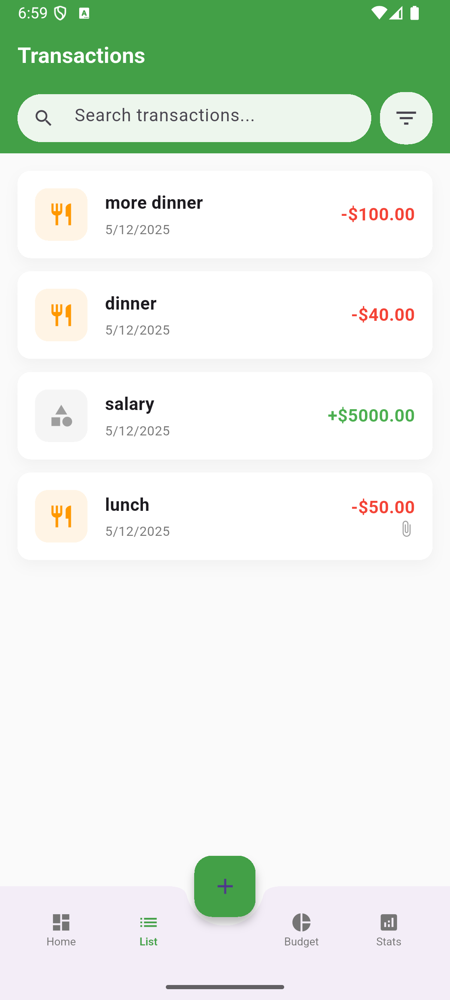
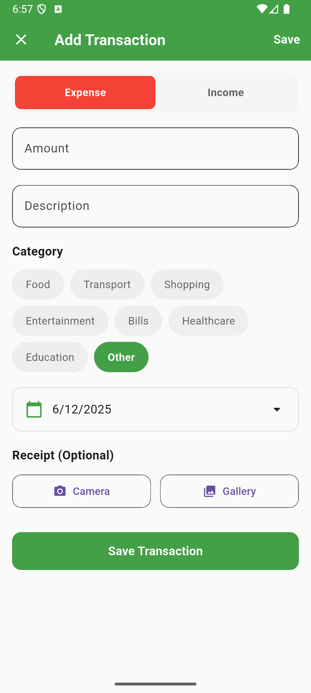
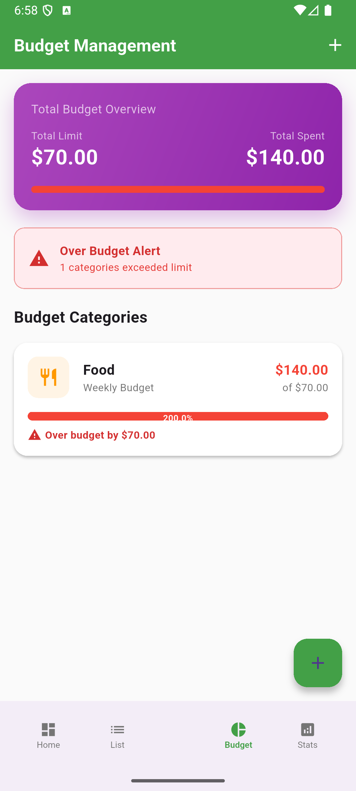
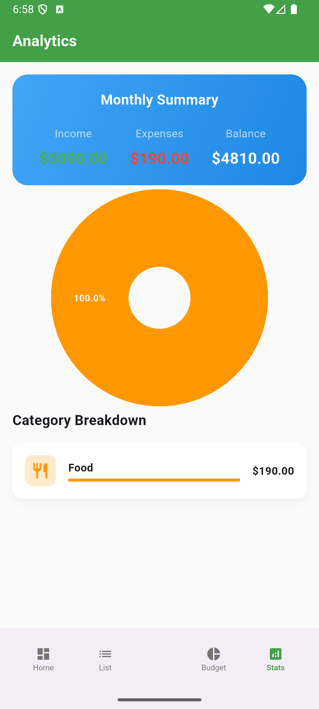

# Numi - Android Personal Finance Tracker

A comprehensive personal finance management app built with Flutter using MVVM architecture and Firebase backend.

## App Overview
Numi helps users track expenses, manage budgets, and achieve financial goals through intelligent categorization and visual insights. The app follows MVVM architecture with clear separation of concerns and implements real-time data synchronization with Firebase.

## Screenshots






## Features
- Expense and income tracking with categorization
- Budget management with visual progress indicators
- Receipt scanning using device camera
- Visual analytics with animated charts
- Real-time data synchronization
- Smooth animations and gesture controls
- Offline support with local caching

## Technical Architecture

### MVVM Implementation
```
┌─────────────────────────────────────────────────┐
│                     Views                       │
│  (Screens, Widgets - UI Only, No Business Logic)│
└───────────────────────┬─────────────────────────┘
                        │ Data Binding
┌───────────────────────▼─────────────────────────┐
│                   ViewModels                    │
│   (Business Logic, State Management, Commands)  │
└───────────────────────┬─────────────────────────┘
                        │
┌───────────────────────▼─────────────────────────┐
│                     Models                      │
│             (Data Structures Only)              │
└─────────────────────────────────────────────────┘
```

### Key Components

**Models**
- `TransactionModel`: Transaction data structure
- `BudgetModel`: Budget data structure
- Pure data classes with no business logic

**ViewModels**
- `TransactionViewModel`: Manages transaction state and operations
- `BudgetViewModel`: Handles budget logic and calculations
- Implements `ChangeNotifier` for state management
- Contains all business logic and async operations

**Views**
- `HomeScreen`: Main navigation and dashboard
- `TransactionsScreen`: Transaction list with search/filter
- `BudgetScreen`: Budget management interface
- `AnalyticsScreen`: Charts and spending insights
- Purely declarative UI bound to ViewModels

## Advanced Features

### 1. Animations 
- Splash screen scale and fade animations
- Card entrance animations with staggered delays
- Animated charts in analytics screen
- Navigation transition animations
- Button scale animations on interaction
- Progress bar animations in budgets

### 2. Gestures 
- **Swipe to delete**: Dismissible transactions with confirmation
- **Pull to refresh**: RefreshIndicator on all list views
- **Tap feedback**: Visual and haptic response on interactions
- **Date picker gestures**: Interactive calendar selection
- **Category selection**: Chip selection with feedback

### 3. Hardware Integration 
- **Camera**: Receipt capture using device camera
- **Gallery**: Image picker for receipt attachments
- **Haptic Feedback**: Vibration on important actions
    - Transaction deletion
    - Category selection
    - Budget warnings

## Asynchronous Programming
- `async/await` for all Firebase operations
- Stream-based real-time updates from Firestore
- Loading states during data fetching
- Error handling with user feedback
- Background image processing for receipts

## Build & Run Instructions

### Prerequisites
- Flutter SDK 3.0+
- Android Studio / VS Code
- Firebase project configured

### Setup
1. Clone the repository:
```bash
git clone https://github.com/yourusername/numi.git
cd numi
```

2. Install dependencies:
```bash
flutter pub get
```

3. Configure Firebase:
    - Create Firebase project at console.firebase.google.com
    - Add Android app with package: `com.mpx.numi`
    - Download `google-services.json` to `android/app/`
    - Enable Anonymous Authentication
    - Enable Firestore Database

4. Run the app:
```bash
flutter run
```

## Testing

### Run Tests
```bash
# All tests
flutter test

# Specific test file
flutter test test/viewmodel_test.dart  # Contains 1 test
flutter test test/widget_test.dart  # Contains 3 tests
```
